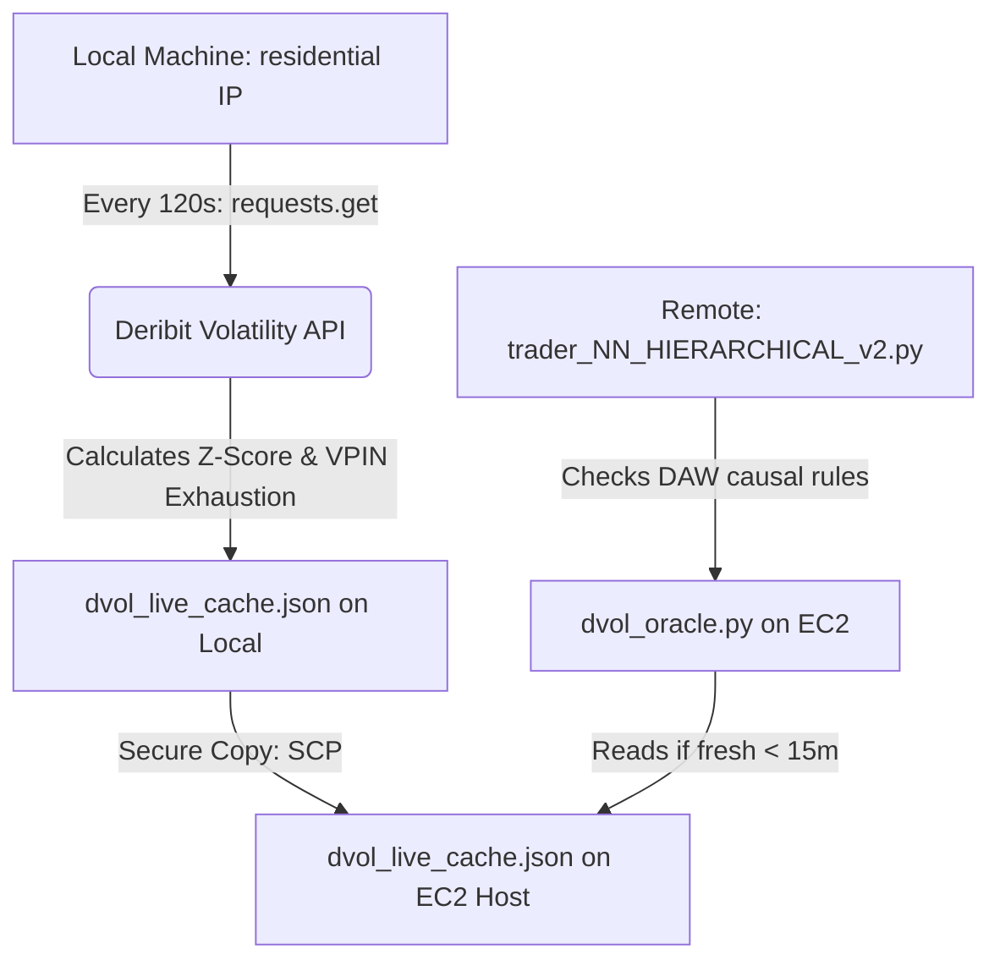

# Crypto Forecasting System | Unified Architecture Blueprint (CCXT Era)

This document provides a fresh, comprehensive overview of the current "DVOL-Inverse" production system. It reflects the unified machine model where sampling, modeling, and trading are co-located on the primary host, powered by CCXT for exchange-agnostic execution.

---

## 1. System Orchestration: Guardian 2.0
The [Guardian Watchdog](file:///Users/stefanbund/Developer/LAPTOP_PREPROCESSOR_MODELER/guardian.py) is the central daemon managing the system's lifecycle across four stages.

### **Staged Boot Sequence**
- **Stage 1: The Sensors**
    - **DVOL Live Sync Daemon**: [`scripts/sync_dvol_live.py`](file:///Users/stefanbund/Developer/LAPTOP_PREPROCESSOR_MODELER/scripts/sync_dvol_live.py)
        - *Role*: Periodically fetches implied volatility (DVOL) from Deribit (every 120s), writes it to a local JSON cache, and copies it to the EC2 host via SCP.
    - **CCXT LOB Sampler (Coinbase)**: [`UNIFIED_TRADER_WORKSPACE/ccxt_sampler.py`](file:///Users/stefanbund/Developer/LAPTOP_PREPROCESSOR_MODELER/UNIFIED_TRADER_WORKSPACE/ccxt_sampler.py)
        - *Role*: Continuously streams Limit Order Book (LOB) depth and price data using the CCXT library for the Coinbase exchange.
        - *Storage & Performance Optimization*: Writes all live data to the local hard drive (`STADIUM_DATA/GRUS-CSV-SAMPLER-DATA`). Files older than 24 hours are migrated to the USB directory `/Volumes/M4_BACKUP/GRUS-CSV-SAMPLER-DATA/` automatically by the backup process.
        - *Rotation*: Automatically rotated every 6 hours to ensure file I/O efficiency.
    - **OKX LOB Sampler**: [`NEW_LOB_SAMPLER/okx_sampler.py`](file:///Users/stefanbund/Developer/LAPTOP_PREPROCESSOR_MODELER/NEW_LOB_SAMPLER/okx_sampler.py)
        - *Role*: Continuously streams LOB depth and price data for OKX.
        - *Storage & Backup*: Writes live data to `NEW_LOB_SAMPLER/data/`. Files older than 24 hours are automatically migrated to `/Volumes/M4_BACKUP/NEW-LOB-SAMPLER-DATA/` every 4 hours.
    - **Kraken LOB Sampler**: [`KRAKEN_LOB_SAMPLER/kraken_sampler.py`](file:///Users/stefanbund/Developer/LAPTOP_PREPROCESSOR_MODELER/KRAKEN_LOB_SAMPLER/kraken_sampler.py)
        - *Role*: Continuously streams LOB depth and price data for Kraken.
        - *Storage & Backup*: Writes live data to `KRAKEN_LOB_SAMPLER/data/`. Files older than 24 hours are automatically migrated to `/Volumes/M4_BACKUP/KRAKEN-LOB-SAMPLER-DATA/` every 4 hours.
    - **Mobile Log Exporter**: [`periodic_log_export.py`](file:///Users/stefanbund/Developer/LAPTOP_PREPROCESSOR_MODELER/periodic_log_export.py)
        - *Role*: Syncs critical telemetry to Google Drive for remote monitoring via Gemini.
- **Stage 2: Intelligence & Execution**
    - **Unified Post-Go-List MLOps Runner**: [`UNIFIED_MLOPS_WORKSPACE/unified_weekly_mlops_runner.py`](file:///Users/stefanbund/Developer/LAPTOP_PREPROCESSOR_MODELER/UNIFIED_MLOPS_WORKSPACE/unified_weekly_mlops_runner.py)
        - *Role*: Executes the weekly Walk-Forward modeling pipeline and configuration deployment directly after Go-List generation on schedule (Monday at 01:00 UTC).
        - *Mechanism*:
            - Updates the `preferred_markets_v2.json` weekly via the Yield Stability Profiler.
            - Runs `yss_dvol_oracle.py` to establish the final correlation-filtered target list in `active_universe.json`.
            - **Mega-Caps** (e.g. `BTC`, `ETH`, `SOL`) are routed to the **PyTorch LSTM time-series modeler** (`mega_cap_lstm_modeler.py`) utilizing Apple Silicon hardware acceleration (`torch.device("mps")`) and their completed models are uploaded to the EC2 production instance.
            - **Global TimesFM & GARCH Engine**: Generates zero-shot return velocity predictions and volatility risk profiles for all active universe symbols, exporting them to `timesfm_garch_forecasts.json` which is copied to the EC2 target (updated daily at 00:00 UTC).
            - Updates and deploys the unified Firebase dashboard (`deploy_dashboard.py`).
        - *Workflow Diagram*:
            ```mermaid
            graph TD
                A["1. Run yield_stability_profiler.py"] -->|preferred_markets_v2.json| B["2. Run yss_dvol_oracle.py"]
                B -->|active_universe.json| C{Is Asset Mega-Cap?}
                C -->|Yes| D["3. Train LSTM Model & Upload .pt"]
                C -->|No/All| E["3. Run generate_timesfm_forecasts.py"]
                D --> F["4. SCP/Rsync Upload forecasts.json"]
                E --> F
                F --> G["5. Regenerate & Push Dashboard"]
            ```
    - **Hierarchical Trader**: [`UNIFIED_TRADER_WORKSPACE/trader_NN_HIERARCHICAL_v2.py`](file:///Users/stefanbund/Developer/LAPTOP_PREPROCESSOR_MODELER/UNIFIED_TRADER_WORKSPACE/trader_NN_HIERARCHICAL_v2.py) (Version 2 production script)
        - *Condition*: Only starts after confirming active LOB data flow.
        - *Role*: Processes live signals through the neural hierarchy.
- **Stage 3: [Reserved]**
- **Stage 4: Visualization**
    - **Reporting Orchestrator**: [`UNIFIED_REPORTING_WORKSPACE/reporting_orchestrator.py`](file:///Users/stefanbund/Developer/LAPTOP_PREPROCESSOR_MODELER/UNIFIED_REPORTING_WORKSPACE/reporting_orchestrator.py)
        - *Role*: Sequential execution of all reporting heartbeats (Accuracy, Strategy, Operations).
    - **Overnight Trades Publisher**: [`MODERN_REPORTING_WORKSPACE/generate_overnight_report.py`](file:///Users/stefanbund/Developer/LAPTOP_PREPROCESSOR_MODELER/MODERN_REPORTING_WORKSPACE/generate_overnight_report.py)
        - *Role*: Scheduled daily service (7:00 AM local time) that pulls Coinbase filled orders from the last 24 hours, computes exact durations and commissions, saves to `data/overnight_trades.csv`, and deploys it to the metastadium site.

### **Watchdog Notification Timeout & Resilience**
- **Non-Blocking Twilio SMS Alerts**: To prevent network outages from freezing the Guardian loop, a strict `timeout=10` constraint is configured on all outbound HTTP POST requests to the Twilio API. This protects the main daemon thread from hanging indefinitely, ensuring that local process monitoring and aggressive memory reclamation routines (`pkill -9 -f`) remain active even if the host loses external internet connectivity.

---

## 2. Neural Intelligence Hierarchy
The system operates on a **3-Tier Ultra-Lean Waterfall** decision engine, optimized for high-velocity execution, alpha preservation, and machine learning-driven risk gating.

1.  **Tier 0: Dynamic Volatility Governor (DAW/DVG)**
    - *Source*: [causality_layer.py](file:///Users/stefanbund/Developer/LAPTOP_PREPROCESSOR_MODELER/DAW_CAUSALITY_LAYER/causality_layer.py)
    - *Mechanism*: Acts as a macro-risk firewall by modulating the fused execution threshold based on the **assigned causal oracle (DVOL or Spot Volatility)**.
    - *Multi-Regime Causal Spot Integration (Added July 4, 2026)*: Rather than relying solely on the BTC-derived DVOL implied volatility index, the system maps each asset to its optimal Granger-causal driver (e.g. `ETH-USD` spot for assets like `CBETH` and `DOT`). If an asset is mapped to a spot oracle, the DVG calculates its real-time rolling realized spot volatility over its optimal Granger lag, gating executions on the spot volatility Z-score instead.
    - *Volatility Oracle Tuning (Updated July 4, 2026)*: The rolling return standard deviation window was shortened from 24 hours (1440 minutes) to 4 hours (240 minutes) to increase responsiveness to immediate volatility shocks.
    - *Adaptive Logic*: `Effective_Threshold = Base * (1 + max(0, Z/2))`. This ensures the "Lean Shield" tightens automatically during high-volatility exhaustion regimes.
2.  **Tier 1: Directional (DVOL Bias)**
    - *Threshold*: Evaluated using the rolling moving average ratio of DVOL.
    - *Role*: Determines directionality and volatility expansion risks.
3.  **Layer 2.5: Google TimesFM Forecast Gate (Added July 14, 2026)**
    - *Source*: [layer2_5_timesfm.py](file:///Users/stefanbund/Developer/LAPTOP_PREPROCESSOR_MODELER/UNIFIED_TRADER_WORKSPACE/core_engine/layers/layer2_5_timesfm.py)
    - *Role*: Serves as a zero-shot conditional mean predictor (\(\hat{r}_{t+h}\)) for returns forecasting.
    - *Mechanism*: Evaluates the pre-computed TimesFM cumulative return prediction vector for the asset (restricted to active symbols listed in `active_universe.json`). If the projected return over the next 15-30 minutes is less than **`+0.25%`**, it immediately vetoes the cycle (`HALTED_AT_TIMESFM`), preventing entry during flat or bearish trends.
4.  **Tier 2: Tactical Filter (KER)**
    - *Threshold*: Configured in `global_config.json` (default 0.85).
    - *Role*: Identifies price travel efficiency to toggle momentum/mean-reversion execution styles.
    - *Trend Gating Engine (Added June 24, 2026, Updated July 4, 2026)*: To prevent catching falling knives in structural downtrends (which caused drawdowns on ADA & CRV), the directional waterfall is guarded by a combined trend-gating filter:
        - **Momentum Governor (EMA-10 Check)**: Vetos buy orders if the current price is below the 10-period Exponential Moving Average (`price < ema_10`), upgraded from EMA-20 to reduce reaction lag from 10 to 5 minutes.
        - **RSI Filter**: Vetos buy orders if the 14-period RSI is oversold and declining below 35 (`RSI < 35`).
        - **Volatility Firewall**: Dynamically scales the minimum directional confidence threshold from `0.60` to `0.75` if normalized volatility (`ATR / Price`) exceeds `1.5%`.


### **Versioned Heuristic Regimes**
The system supports toggleable heuristic versions configured via `"heuristic_regime_version"` in the settings. This allows switching dynamically between historical baselines and newly optimized risk management rules.

| Rule / Filter | `MAY_17` Regime | `JUNE_02` Regime |
| :--- | :--- | :--- |
| **Volatility Compression** | Strict limit: DVOL $Z \le 0.5$ | Dynamic limit: DVOL $Z \le 1.0$ if Trend Confidence $\ge 0.75$, else $Z \le 0.5$ |
| **VPIN Toxicity Gate** | Exhaustion score $< 30$ | Exhaustion score $< 30$ |
| **Reversion Gate (UWR)** | Bypassed (Not evaluated) | Upper Wick Ratio (UWR) $< 0.40$ (low resistance) |

> **Legacy/Retired Tiers**:
> - **Crash (Safety)**: Retired May 2026. Vetoed trades if a significant drawdown (>3%) was imminent.
> - **Imbalance (Tier 2)**: Retired May 2026. Superseded by the DAW Causal Gate.
> - **Markov Risk (Tier 3)**: Retired May 2026. Superseded by the DAW Causal Gate.
> - **Generalist (Tier 5)**: Retired May 2026. Bypassed in favor of the Lean stack.
> - **Specialist (Tier 6)**: Retired May 2026. Bypassed in favor of the Lean stack.

---

## 3. Live Inference & Workflow
1.  **Buffer Management**: The predictor fetches minimal recent context from the exchange API or local cache.
2.  **In-Memory Calculation**: Indicators (RSI, EMAs, ATR) are computed instantly within the agent's memory space.
3.  **Hierarchical Evaluation (Lean Stack)**:
    - **Step 1**: Does the macro regime allow for alpha? (**DAW Gate**)
    - **Step 2**: Should I buy? (**Directional Trend**)
4.  **Action Handoff**: Executable signal is generated only if both active tiers provide a "Green Light." It then hands off control to the `async_trader_rewritten.py` layer.

### The Brain vs. The Hands (Role Separation)
An important distinction in the architecture is the strict separation of responsibilities between `trader_NN_HIERARCHICAL_v2.py` (The Brain) and `async_trader_v2.py` (The Hands).

- **The Brain: `trader_NN_HIERARCHICAL_v2.py` (The Orchestrator)**
  - **Data Intake & Modeling:** Continuously monitors live market data, calculates technical indicators (ATR, RSI, etc.), and feeds them into machine learning models for predictions.
  - **Risk Management:** Applies strict waterfall logic—checking the DAW Causality volatility firewall, ensuring trend confidence, and verifying the symbol isn't blacklisted.
  - **Capital Allocation:** Checks the live USD account balance, classifies the coin as a Mega Cap or Mid Cap, and calculates the exact dollar size and dynamic profit target. Additionally, it dynamically scales the active tranche limit (`self.max_tranches = int(1.0 / self.mid_cap_pct)`) to ensure 100% of the trading budget is utilized without manual slot adjustments, or respects an explicit override config parameter (`capital_allocation.max_tranches` in `global_config.json`, which was configured to `100` on June 25, 2026, to allow freedom of tranche creation under Size-to-Depth Ratio math).
  - **Delegation:** Once it decides exactly *what* to do, it launches `async_trader_v2.py` and hands it the specific execution instructions.

- **The Hands: `async_trader_v2.py` (The Execution Engine)**
  - **Broker Interface:** Receives the symbol, dollar amount, and profit target from the Orchestrator, logs into the exchange API, and submits the Limit Buy order.
  - **Order Management:** Waits for the Buy order to be filled. Once filled, it mathematically calculates the take-profit price and submits the Sell order.
  - **Safety Protocols:** Handles retries for API errors and monitors the "Circuit Breaker" timeout (reverted to a static **12-hour timeout** on June 19, 2026, after an audit revealed the dynamic OU reversion speed timeout clipped trades too early, dragging win rates down to 52%). If a Sell order sits for too long, it cancels the original order, attempts a **5-minute Maker limit order** at the spot price to liquidate (minimizing taker fees and spread slippage), and falls back to a guaranteed market order sell-off if still unfilled.
  - **Automated Alerts:** Dispatches non-blocking Twilio SMS alerts to the operator on critical API/liquidation execution failures.
  - **Telemetry:** Records the exact profit, latency, and success into the CSV logs and triggers the reporting scripts.

By splitting these roles, the system is highly efficient—the heavy machine learning loop never gets paused or delayed while waiting for a slow exchange API to fill a trade.

---

## 4. Data Architecture & Logistics
The system utilizes a unified machine model where all processing is co-located to minimize latency and synchronization overhead.

- **Primary Data Root**: `/Users/stefanbund/Developer/LAPTOP_PREPROCESSOR_MODELER/STADIUM_DATA`
- **Model Vault**: `STADIUM_DATA/MODELS` (Subdivided into Directional; Crash is legacy).
- **LOB Active Storage Locations (SSD)**:
  - Coinbase: `STADIUM_DATA/GRUS-CSV-SAMPLER-DATA`
  - OKX: `NEW_LOB_SAMPLER/data`
  - Kraken: `KRAKEN_LOB_SAMPLER/data`
- **LOB Historical Vaults (USB Drive)**:
  - Coinbase: `/Volumes/M4_BACKUP/GRUS-CSV-SAMPLER-DATA`
  - OKX: `/Volumes/M4_BACKUP/NEW-LOB-SAMPLER-DATA`
  - Kraken: `/Volumes/M4_BACKUP/KRAKEN-LOB-SAMPLER-DATA`
- **Workspace USB Backup & File Migration**: To preserve host SSD space and ensure data redundancy, the system executes an automated backup and data migration routine:
  - **Local Cron Schedule**: Managed via the macOS system `crontab`, running twice daily at 9:00 AM and 9:00 PM local time (`0 9,21 * * *`).
  - **Workspace Backup**: Runs [local_usb_backup.sh](file:///Users/stefanbund/Developer/LAPTOP_PREPROCESSOR_MODELER/local_usb_backup.sh) to synchronize the repository to the USB vault at `/Volumes/M4_BACKUP/LAPTOP_PREPROCESSOR_MODELER_BACKUP/` (excluding virtual environments, logs, caches, and active databases).
  - **LOB Sampler Migration**: Scans local SSD sampler directories for files older than 24 hours (Coinbase, OKX, and Kraken) and moves them to `/Volumes/M4_BACKUP/` to build historical vaults for model training without clogging local disk space.
- **Telemetry Sync**:
  - **Local to Data Science Host**: Hourly synchronization of critical local MLOps logs to the centralized data science host (`okx-ml.local`) is managed by the Guardian Watchdog calling `scripts/sync_logs_to_ml_host.sh`.
  - **EC2 to Reporting Workspace**: Because the active trader and LOB sampler now run in the cloud on EC2, logs (`trading_bot.log`, `executions_log.csv`, and audit logs) are dynamically pulled from the remote host (`44.200.49.112`) to local (`logs/remote`) via `scripts/pull_remote_logs.sh` at the start of each execution loop inside the Reporting Workspace (`generate_ledger_data.py`).
  - **Daily Log Synchronization & EC2 Cleanup**: To prevent disk congestion on the remote EC2 instance from accumulating `trading_bot.log.*` rotated log files (each ~10MB), [daily_log_sync.sh](file:///Users/stefanbund/Developer/LAPTOP_PREPROCESSOR_MODELER/scripts/daily_log_sync.sh) runs daily. It copies the active `trading_bot.log`, downloads all rotated/completed `trading_bot.log.[1-5]` files to a local date-stamped archive directory (`logs/remote/archive/YYYYMMDD/`), verifies the integrity of the downloaded files, and deletes the rotated files from the remote host. It also triggers remote log rotation for watchdog/guardian services.
  - **Preferred Markets Upload**: Upon weekly regeneration of `preferred_markets.json` by the local MLOps script (`unified_weekly_mlops_runner.py` / `yield_stability_profiler.py` on Mondays at 01:00 UTC), the file is automatically transferred via SSH to the production Amazon instance (`44.200.49.112`) at `/opt/hft_trader/preferred_markets.json` (root directory) using the local SSH private key (`hft-trader-key.pem`), keeping the AWS trader in sync with local MLOps asset selection.
  - **Continuous LSTM Model Upload**: Immediately upon successful completion of each individual symbol training cycle inside the Mega Cap LSTM Orchestrator, the new `.pt` model is uploaded using the local private key (`hft-trader-key.pem`) to the remote EC2 instance (`44.200.49.112`) under `/opt/hft_trader/STADIUM_DATA/MODELS/CORE_MODULES/`, keeping the cloud neural network synchronized with local model retraining in real time.
  - **Automated Remote Model Pruner**: To prevent disk congestion on the remote EC2 host, the MLOps runners automatically execute a model pruner ([prune_remote_models.py](file:///Users/stefanbund/Developer/LAPTOP_PREPROCESSOR_MODELER/UNIFIED_MLOPS_WORKSPACE/prune_remote_models.py)) at the end of every upload cycle. The pruner resolves active Go-List symbols from `preferred_markets.json`, matches their corresponding model filenames (LSTM `.pt` for mega-caps, RF `.joblib`/`.py` and reversion speed estimators for mid-caps), and executes SSH pruning commands to delete all stale/inactive models from the remote directories.
  - **Local-to-EC2 Volatility Sync (DVOL Cache)**: Because the EC2 instance is blocked by Deribit/Cloudflare firewalls for public REST API calls, the local machine (which is not blocked) runs the `DVOL Live Sync Daemon` to retrieve BTC implied volatility state from Deribit every 120 seconds. It caches this locally as `dvol_live_cache.json` and copies it via SCP to `/opt/hft_trader/DAW_CAUSALITY_LAYER/` on the EC2 host. The remote `dvol_oracle.py` then reads from this fresh cache file to verify the DAW regime. To protect against stale sync states, both trader execution engines (`async_trader.py` and `async_trader_v2.py`) enforce a strict rule requiring that the cache file exists and its internal timestamp is no more than two minutes (120 seconds) old, gating execution if the sync fails or is stale.

---

## 5. Operational Control & Configuration
- **Global Config**: [`global_config.json`](file:///Users/stefanbund/Developer/LAPTOP_PREPROCESSOR_MODELER/global_config.json)
    - The single source of truth for all paths, thresholds, and exchange-specific parameters.
- **Shared Library**: [`shared_lib/config_loader.py`](file:///Users/stefanbund/Developer/LAPTOP_PREPROCESSOR_MODELER/shared_lib/config_loader.py)
    - Dynamically resolves paths and injects environment secrets (Twilio, GitHub PAT).
- **Command Wrapper Suite**:
    - `scripts/start_guardian.sh`: Launches the system.
    - `scripts/stop_guardian.sh`: Safe shutdown.
    - `scripts/status.sh`: System health snapshot.

### **HFT Pricing Target Configuration**
- **Price Target Parameter**: The HFT trading mechanism strictly insists on a **`0.025` (2.5%)** price target (configured as `take_profit` in `hardened_config.json`) for generalist mid-caps.
- **Dynamic Volatility Targets (Mega-Caps)**: For mega-cap tokens (`BTC`, `ETH`, `SOL`), targets are calculated dynamically based on a **1000-tick rolling standard deviation** (volatility proxy) clipped between **$0.10\%$ and $0.80\%$** (`dynamic_target_scalp_pct = clip(1.5 * vol_proxy, 0.0010, 0.0080)`). This scales targets to fit low-volatility regimes (averaging $\sim0.11\%$ for BTC/ETH) and high-volatility regimes ($\sim0.14\%$ for SOL), significantly reducing capital lockups (drifters).
- **No 1% Target**: Any legacy references to a 1% price target are obsolete and deprecated; the system enforces either the 2.5% (`0.025`) threshold for mid-caps or the dynamic volatility-scaled target for mega-caps.


### **Deployment & Post-Deployment Verification**
- **Deployment Helper**: [`UNIFIED_TRADER_WORKSPACE/deployment_helper.py`](file:///Users/stefanbund/Developer/LAPTOP_PREPROCESSOR_MODELER/UNIFIED_TRADER_WORKSPACE/deployment_helper.py)
    - *Role*: Handles code/config sync, builds virtual environments, and sets execution flags.
- **Certification Verifier**: [`scripts/deployment_verifier.py`](file:///Users/stefanbund/Developer/LAPTOP_PREPROCESSOR_MODELER/scripts/deployment_verifier.py)
    - *Role*: Automatically executes on the remote host post-deploy to certify system integrity (checking for credentials/key leaks, virtual environment health, LSTM and Directional model availability, and AWS Secrets Manager integration).

---

## 6. Analytics & Public Telemetry
All visual intelligence is compiled and published via the system reporting scripts.

- **Legacy GitHub Pages Hub**: [View Hub](https://stefanbund.github.io/stadium-public-data/coinbase/analytics_dashboard.html) (Updates siloed by exchange name, e.g., `/coinbase`).
- **Modern Unified Dashboard (metastadium.web.app)**: Hosted on Google Firebase.
  - **Reporting Workspace**: Managed inside [`MODERN_REPORTING_WORKSPACE/`](file:///Users/stefanbund/Developer/LAPTOP_PREPROCESSOR_MODELER/MODERN_REPORTING_WORKSPACE/) and governed by `orchestrator.py` on a 15-minute run cycle.
  - **Dynamic Compilation**: Computes and updates `dashboard_data.json` (via `generate_data.py`), `ledger_data.json` (via `generate_ledger_data.py`), `landscape_data.json` (via `generate_data.py`), and `deployments_data.json` (via `generate_data.py`).
  - **Market Volatility & NN Audits**: Regenerates live DVOL oracle metrics and parses the last 200 neural network evaluations to dynamically refresh the Go-List tree hierarchy and DVG regime status on the website's Market Landscape page (`landscape.html`) on every update cycle.
  - **DVOL Sync Monitoring**: Inspects the modification time of `dvol_live_cache.json` on the remote EC2 host to display the **DVOL Volatility Sync** status card on the deployments dashboard (`deployments.html`), certifying that live volatility metrics are syncing to the AWS trading instance in real time.
  - **HFT Practice Trades (sfgk_hft.html)**: Visualizes historical dry-run and high-fidelity simulated scalp executions generated by the upgraded `async_sfgk_trader.py` HFT strategy engine. Automatically compiled via `generate_sfgk_data.py` (which aggregates `sfgk_executions_log.csv` and `sfgk_executions_log_legacy.csv`), it displays interactive cumulative practice profit/loss curves, token performance breakdowns, and a searchable execution ledger. Localizes all timestamps to the US East Coast timezone (`US/Eastern`) to align directly with active Coinbase logs.
  - **US East Coast Timezone Display**: Localizes all timestamps shown on the Coinbase P&L dashboard (`coinbase_pnl.html`) and the Recent Coinbase Executions Ledger to the US East Coast timezone (`US/Eastern`) for consistent operational reviews.

---

## 7. Fleet Information System (FIS)
The industrial backtesting arm of the project, used for yield discovery and parameter hardening.

- **Workspace**: `FLEET_INFORMATION_SYSTEM/`
- **Industrial Lean Baseline**: Standardized on high-velocity Random Forest models (`--fast-rf`) to bypass compute-heavy TPOT searches during fleet-wide deployment.
- **SFGK Decision Engine Backtester**: [`backtest_sfgk.py`](file:///Users/stefanbund/Developer/LAPTOP_PREPROCESSOR_MODELER/FLEET_INFORMATION_SYSTEM/backtest_sfgk.py) runs multi-year regime gating validations on the verbatim `DecisionEngine` using historical DVOL index data and midpoint candles. Operates with dynamic weekly Walk-Forward parameter re-optimization over 30-day sliding lookback windows to evaluate veto efficiency, slump avoidance, and parameter migration.
- **Experiment Vault**: `FLEET_INFORMATION_SYSTEM/EXPERIMENTS/FIS_INDUSTRIAL_LEAN_v1` (The definitive system blueprint).


---

## 8. Operational Workflows
The system defines standard operational workflows inside `.agents/workflows/` to simplify diagnostics, auditing, and deployment.

- **Market Landscape View**: [`.agents/workflows/market_landscape.md`](file:///Users/stefanbund/Developer/LAPTOP_PREPROCESSOR_MODELER/.agents/workflows/market_landscape.md)
  - *Utility*: Runs `summarize_market_landscape.py` to query the live DVOL Oracle (Z-score, trend, RSI) and parse the last 200 neural network evaluations to diagnose execution pauses.
- **Summarize Recent Trades**: [`.agents/workflows/summarize_recent.md`](file:///Users/stefanbund/Developer/LAPTOP_PREPROCESSOR_MODELER/.agents/workflows/summarize_recent.md)
  - *Utility*: Aggregates trade statuses (PASS/FAIL/PENDING) per symbol to see live execution history.

---

## 9. DVOL Volatility Index Caching Bridge

### **Role (What it is)**
The `dvol_live_cache.json` file is a lightweight telemetry cache containing the latest BTC option implied volatility (DVOL) metrics: close, Z-score, RSI, 1-hour linear regression momentum, and VPIN exhaustion/toxicity level.

### **Relevance (Why it is necessary)**
AWS EC2 IP address ranges are consistently blocked or rate-limited by exchanges (via Cloudflare/WAF) on their public unauthenticated API endpoints. Directly querying Deribit's DVOL index from your cloud instance fails, resulting in a fallback `fused_score = 0.0000` (vetoing all trade opportunities like GNO and AVAX). Caching the index state on the local machine (which is not blocked) and copying it to the remote server allows the DAW Causality Layer to operate flawlessly without direct public REST API dependencies from EC2.

### **Operation (How it works)**


1. **Generation**: The local `DVOL Live Sync Daemon` (monitored by Guardian) queries the Deribit DVOL API every 120 seconds.
2. **Transfer**: The daemon writes the state to `dvol_live_cache.json` and copies it via SCP using the SSH private key to `/opt/hft_trader/DAW_CAUSALITY_LAYER/` on the remote EC2 instance.
3. **Consumption**: When evaluating live signals on the cloud server, `dvol_oracle.py` checks `dvol_live_cache.json`. If it's less than 15 minutes old, it reads the cache metrics instead of querying the API, bypassing the EC2 firewall block.

---

## 10. Software Development Practice: Feature Numeralization Catalog (FIS Backtest Master)
To ensure high-fidelity translation of algorithmic concepts from simulation to production, we require all decision structures and strategies to trace directly to their backtest specifications in the **FIS Backtest Master**. Production trader comments must explicitly reference these numeralized keys:

*   **`[FIS-1]`**: **HMM-Based Multi-Regime Volatility Selection** (Regime 0: High Volatility, Regime 1: Chaos/Stay Flat, Regime 2: Low Volatility/Scalping).
*   **`[FIS-2]`**: **Regime Specialist Models** (Random Forest classifiers for specific regimes, or CoreLSTM models for mega-caps).
*   **`[FIS-3]`**: **Imbalance Layer & Order Book Pressure** (LOB precursor tracking for order flow pressure).
*   **`[FIS-4]`**: **Tandem Confidence Score Gate** (Fusing specialist model probability and LOB imbalance metrics: `Tandem_Score = (Spec_Conf + Imb_Conf) / 2` gating execution above threshold).
*   **`[FIS-5]`**: **Dynamic Target Magnitude Regressor** (Exit logic estimating Maximum Favorable Excursion using VWAP distance, ATR, and ADX).
*   **`[FIS-6]`**: **Macro Risk/Crash Firewall (Veto)** (Vetoing trade signals or stopping active trades if systemic risk metrics or DVOL Z-score levels exceed limits).
*   **`[FIS-7]`**: **Portfolio Tranche Wallet Sizing** (Dynamic capital allocation and slot limits based on active regime or asset tier).
*   **`[FIS-8]`**: **Temporal Exit Horizon (Timeout)** (Enforcing time-based exit bounds, e.g., 14 days in backtests, 12 hours static in production, to prevent capital decay instead of static stop losses).
*   **`[FIS-9]`**: **70/30 Chronological Gating** (Anti-overfitting rule preventing look-ahead bias by splitting train/validation/test chronologically).

---

## 11. FIS Backtest Master Registry and Archival Policy
To prevent data loss and ensure strategy reproducibility, the development of the backtesting suite must comply with the following policy:

1. **Non-destructive Execution**: Backtests must never overwrite historical backtest configurations or outputs.
2. **Immutable Experiment ID & Folder**: Each backtest run must be archived in a discrete and separate folder under `FLEET_INFORMATION_SYSTEM/EXPERIMENTS/` using the naming schema: `<YYYYMMDD_HHMMSS>_<Title>`.
3. **Structured Snapshotting**: Each experiment folder must contain:
   - `config_snapshot.json`: The exact parameter configuration used.
   - `results.json`: Key performance indicators and metrics.
   - `methodology.md`: Date, strategy details, asset models, and tabular metrics summary.
   - `utilities/`: Snapshotted helper classes/orchestrators associated with the run.
4. **Permanent Global Registry**: Every committed backtest must be appended to the ongoing global index file at [`FLEET_INFORMATION_SYSTEM/EXPERIMENTS/experiment_registry.csv`](file:///Users/stefanbund/Developer/LAPTOP_PREPROCESSOR_MODELER/FLEET_INFORMATION_SYSTEM/EXPERIMENTS/experiment_registry.csv) to trace history, scores, and configurations permanently.

---

## 12. Remote Production Host Hardware Profile
The cloud trading node runs on AWS EC2, configured as follows:
- **Instance Class**: `t3.xlarge` (upgraded July 4, 2026, from `c6i.large`).
- **Specifications**: 4 vCPUs, 16 GiB RAM (EBS storage root volume).
- **Public IP**: **`44.200.49.112`**.
- **Resource Allocation**: The 16 GiB RAM capacity enables running dynamic symbol Go-Lists (up to 65 parallel symbols under YSS >= 30.0 gating) without memory exhaustion (each symbol process pair consuming ~150MB of RAM).

---

## 13. Hybrid Model Oversight and Decision Auditor
A lightweight telemetry monitor and custom agent skill designed to audit live execution statistics and neural network decisions:
- **Telemetry Monitor**: [`scripts/model_auditor.py`](file:///Users/stefanbund/Developer/LAPTOP_PREPROCESSOR_MODELER/scripts/model_auditor.py) executes every 15 minutes as part of the Modern Reporting loop. It scans trade databases (`executions_log.csv`) and neural network logs (`trading_bot.log`) to calculate overall system win rates, individual asset win rates, consecutive losses, and DAW Volatility Veto rates.
- **Alert Triggering**: The monitor writes its output to `logs/audit_status.json` and exits with code `1` if any critical thresholds are crossed (e.g. system win rate < 55%, asset 10-trade win rate < 45%, or consecutive losses >= 4), prompting the operator to run diagnostic audits.
- **Workspace Custom Skill**: [`.agents/skills/model_oversight/SKILL.md`](file:///Users/stefanbund/Developer/LAPTOP_PREPROCESSOR_MODELER/.agents/skills/model_oversight/SKILL.md) provides standard protocols for the AI agent to evaluate auditor status, analyze rejection categories, and safely coordinate user-approved configuration updates (such as updating the `hardened_config.json` blacklist) via Antigravity Planning Mode.

---

## 15. Archival Note
The legacy documentation and decommissioned tools (Pre-CCXT/Pre-DVOL) have been moved to `TECHNICAL_DEBT/`:
- [`OLD_SYSTEM_ARCHITECTURE.md`](file:///Users/stefanbund/Developer/LAPTOP_PREPROCESSOR_MODELER/TECHNICAL_DEBT/OLD_SYSTEM_ARCHITECTURE.md)
- `advanced-sdk-ts/` (Legacy Node.js LOB Sampler)


## Update (July 2026): 5-Layer Funnel & MLOps Architecture
The system has been migrated to a highly modular 5-Layer Funnel architecture under `UNIFIED_TRADER_WORKSPACE/`. 

**1. MLOps Pre-Flight (`mlops/`)**
- `ysp_asset_screener.py`: Identifies assets and their optimal Z-Score/VRP threshold configurations.
- `yss_dvol_oracle.py`: Refines assets based on direct/inverse correlation with macro DVOL and Majors.

**2. Data Acquisition (`core_engine/data/`)**
- `coinbase_level3_consumer.py`: 24-hour WebSocket consumer connecting to Coinbase Level 3 (`level2` and `market_trades`). Rolls up $\mu, \alpha, \delta$ intensities into cloud-native Parquet partitions.

**3. Execution Orchestration (`core_engine/decision_engine.py`)**
Pipes ticks sequentially through 5 distinct validation gates powered by live data ingest feeds:
- **Layer 1 (DAW)**: Master Override comparing current state (z-score and VRP) to YSP optimal parameters. Implemented dynamic asset-specific routing based on Granger causality (e.g. `ETH` uses `DVOL_ETH`; `BTC`, `SOL`, and `LTC` use `DVOL_BTC`).
- **Layer 2 (DVOL)**: Directional Bias based on DVOL momentum (rolling short-term 60m and long-term 240m moving averages).
- **Layer 3 (KER)**: Tactical Filter using Kaufman Efficiency Ratio calculated over a rolling 30-hour history fetched directly from the public Coinbase REST API.
- **Layer 4 (SFGK)**: Microstructure Pricer utilizing data lake intensities for optimal limit order depth. Incorporates a weighted blending warm-up algorithm:
  $$\text{L3 Intensity} = (w \times \text{Live Avg}) + ((1 - w) \times \text{Historical Baseline})$$
  where $w = \frac{\text{elapsed\_time\_since\_activation}}{86400.0}$ (capped at 1.0), enabling zero-lookahead, immediate cold-start trading while live Parquet partitions build up.
- **Layer 5 (Hawkes)**: Execution Sniper delaying orders during toxic cascades.

**4. Watchdog & Capital Scaling (`guardian_sfgk.py`)**
- Manages the active trade loop processes for all symbols.
- Configured with a scaled simulated portfolio budget of **$90,000** total, split as a flat **$12,857** per asset position size (applied to `SOL`, `LINK`, `AVAX`, `ADA`, `DOGE`, `BTC`, and `ETH` universe).
- **Honest Practice Simulation Mode**: Implements a blocking real-time price monitoring loop. In practice mode, the trader process holds funds locked and polls the live Coinbase ticker REST API every 15 seconds. The tranche budget is only released when the price target is reached or if the 1-hour timeout window expires (resulting in a logged timeout failure), ensuring 100% disciplined performance metrics.


### Official Deprecation Notice (July 2026)
As of July 2026, the legacy Neural Network classifiers (and associated regime-aware models) have been officially deprecated in favor of the pure-mathematical 5-Layer Funnel architecture. The Funnel is now the sole execution and validation engine for the trader, drastically reducing compute overhead and latency while maintaining superior performance metrics.

## Local vs. Remote Process Delineation

To maintain optimal execution latency, minimize cloud compute costs, and utilize high-capacity local compute for machine learning workloads, the system operations are divided into distinct local and remote tiers:

### 1. Local Processes (Laptop / Mac Mini `okx-ml.local`)
These operations run locally to leverage strong Apple Silicon GPU/CPU hardware:
* **Yield Stability Profiler (YSP) Screening**: Runs weekly to screen candidate assets and calculate Yield Stability Scores (YSS). The results are saved in `preferred_markets.json`/`preferred_markets_v2.json` and automatically copied to the remote server via SSH/SCP.
* **TimesFM Zero-Shot & GARCH Forecasting**: Runs daily at 00:00 (midnight) to perform deep learning sequence predictions and fit GARCH volatility parameters for symbols listed in `active_universe.json`. The resulting `timesfm_garch_forecasts.json` is synced to the EC2 production instance daily.
* **MLOps Model Training**: Heavy model training and pre-processing tasks (such as Auto-ML TPOT runs) are run locally on-demand and completed models are copied to the server.

### 2. Remote Cloud Processes (AWS EC2 Instance)
These operations run continuously in the cloud for 24/7 reliability and low latency connectivity to the exchange:
* **Active HFT Trader Engine**: The production trading system (running under the `guardian_sfgk.py` watchdog) executes the 5-Layer Funnel trader loops for active symbols.
* **DVOL Oracle / DAW Gate**: Evaluates the live market regimes and checks against local cached state.
* **Unified Reporting Orchestrator**: Runs as a background daemon on a 15-minute loop natively on the EC2 server, pulling local logs, updating dashboards (`ledger.html`, `sfgk_hft.html`, etc.), and deploying the reports directly to Firebase Hosting.

