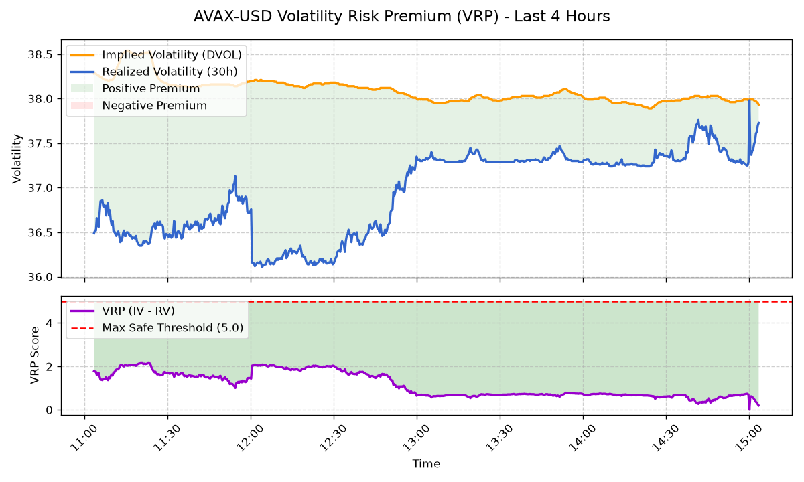
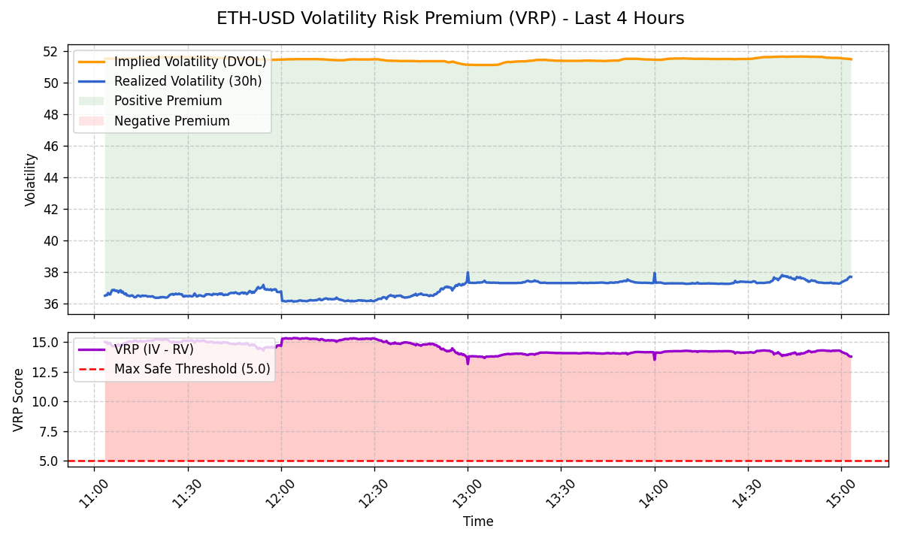
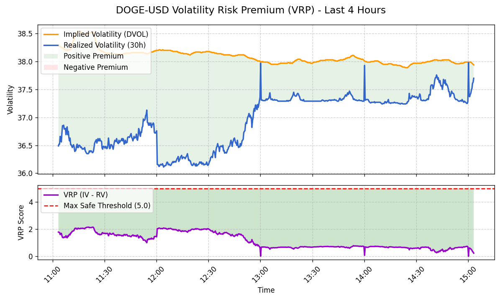
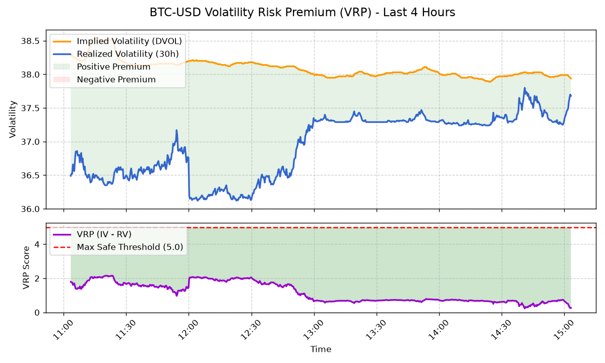

# 🛡️ Unified Trading System Hourly Status & Visual Intelligence
> **Report Generated**: `2026-08-14 09:54:24 AM PDT (2026-08-14 16:54:24 UTC)`  
> **System Health**: **🟡 DEGRADED / RESTRICTED** | **Win Rate**: `0.0%` | **Completed Trades**: `0`

---
## 1. ⚡ Macro Volatility & Layer 1 DAW Causal Oracle
Real-time Deribit implied volatility (DVOL) proxy tracking against mathematically optimal Yield System Parameters (YSP) per asset.

| Symbol | Proxy Oracle | Live Z-Score | Optimal Limit (YSP) | Safety Margin | Live VRP | Optimal VRP (YSP) | DAW Safety Verdict |
| :--- | :--- | :--- | :--- | :--- | :--- | :--- | :--- |
| `AVAX-USD` | DVOL_BTC | **+1.12** | **-0.50** | **+1.62** | **+9.83** | 5.0 | 🔴 DAW VETOED |
| `ETH-USD` | DVOL_ETH | **-0.83** | **-0.50** | **-0.33** | **+22.42** | 5.0 | 🔴 DAW VETOED |
| `ADA-USD` | DVOL_BTC | **+1.12** | **-0.50** | **+1.62** | **+9.94** | 5.0 | 🔴 DAW VETOED |
| `DOGE-USD` | DVOL_BTC | **+1.12** | **-0.50** | **+1.62** | **+9.94** | 5.0 | 🔴 DAW VETOED |
| `BTC-USD` | DVOL_BTC | **+1.12** | **-0.50** | **+1.62** | **+9.94** | 5.0 | 🔴 DAW VETOED |
| `LINK-USD` | DVOL_BTC | **+1.12** | **-0.50** | **+1.62** | **+9.94** | 5.0 | 🔴 DAW VETOED |
| `SOL-USD` | DVOL_BTC | **+1.12** | **-0.50** | **+1.62** | **+9.94** | 5.0 | 🔴 DAW VETOED |


  

  

  

  

  

  

  

### 📖 Volatility & VRP Safety Barometer
The system's Layer 1 DAW Causal Gate continuously gauges execution safety using **Deribit DVOL Z-Score ($Z$)** and **Variance Risk Premium (VRP)**:
- **Mathematical Principle**: $\text{VRP} = \text{IV}_{\text{Deribit DVOL}} - \text{RV}_{\text{Realized Vol}}$ and $Z = \frac{\text{DVOL}_t - \mu_{\text{4h}}}{\sigma_{\text{4h}}}$.
- **Regime Safety Spectrum**:
  - 🟢 **Safe / Compression ($Z \le Z_{opt}$)**: Derivatives market prices low tail risk. Order books are deep, adverse selection is minimal, and TimesFM zero-shot scalps operate at peak win rates.
  - 🔴 **Hostile / Expansion ($Z > Z_{opt}$)**: Options pricing aggressive shock risk. Taker order sweeps cause adverse selection; **DAW Causality Veto is active** to preserve capital.
---
## 2. 🔒 MLOps & Trading Telemetry Provenance & Utilization Certification: 🟢 ALL SYNCED & CERTIFIED
We hereby certify that the mission-critical algorithmic data assets uploaded by the Mac Mini MLOps node have been audited for freshness, fall within their strict operational due dates, and are actively being utilized by the live EC2 HFT Trader.

| Status | Data Asset | Freshness / State | Details / Timestamp |
| :---: | :--- | :--- | :--- |
| ✅ | **Go-List JSON** | Fresh (26.76h old) | 08-13 07:08 |
| ✅ | **TimesFM Forecasts** | Fresh (1.88h old) | 08-14 08:02 |
| ✅ | **Holding Times config** | Fresh (48.25h old) | 08-12 09:39 |
| ✅ | **BTC DVOL Cache** | Fresh (0.01h old) | 08-14 09:54 |
| ✅ | **ETH DVOL Cache** | Fresh (0.01h old) | 08-14 09:54 |
| ✅ | **Live Trading Telemetry** | Fresh (0.00h old) | 08-14 09:54 |

<br>

> **Utilization Certification**: ✅ **CERTIFIED.** The Guardian Watchdog is ONLINE and EC2 traders are actively querying the freshest MLOps data artifacts (Found 1946 recent read events).


---
## 2. 📊 8-Stage Funnel Live Decision Telemetry
Layer-by-layer tick evaluation waterfall and asset-specific performance tracking.

| Funnel Filter Layer | Total Rejections | % of Rejections |
| :--- | :--- | :--- |
| Layer 1: DAW Causal Volatility Veto | `17,694` | **100.0%** |
| Layer 2A: Vol Surface Skew & VRP Gate | `0` | **0.0%** |
| Layer 2B: DVOL Directional Momentum Bias | `0` | **0.0%** |
| Layer 2C: KER Efficiency Noise Filter | `0` | **0.0%** |
| Layer 2.5: TimesFM Forecast Velocity Gate | `0` | **0.0%** |
| Layer 3: SDR Liquidity Sizing Floor | `0` | **0.0%** |
| Layer 4: SFGK Commercial Margin Gate (< 0.25%) | `0` | **0.0%** |
| Layer 5: Hawkes Microstructure Toxicity | `0` | **0.0%** |
| System: Asset Cooldown Active | `0` | **0.0%** |
| System: Asset Blacklist Gate | `0` | **0.0%** |


---
## 3. 💰 Coinbase Treasury, Balances & Active Orders
Live balance sheet and open maker liquidity positions from Coinbase CDP.

### Active Wallet Balances
| Currency | Available | Hold | Total Balance |
| :--- | :--- | :--- | :--- |
| `CBETH` | 0.9734 | 0.0000 | **0.9734** |
| `CRV` | 0.0500 | 0.0000 | **0.0500** |
| `ADA` | 13260.3378 | 0.0000 | **13260.3378** |
| `DOGE` | 0.1000 | 0.0000 | **0.1000** |
| `FIL` | 0.0050 | 0.0000 | **0.0050** |
| `ALEPH` | 2.4000 | 0.0000 | **2.4000** |
| `SKL` | 0.1000 | 0.0000 | **0.1000** |
| `SAFE` | 0.1400 | 0.0000 | **0.1400** |
| `AIOZ` | 0.3000 | 0.0000 | **0.3000** |
| `BTRST` | 0.0100 | 0.0000 | **0.0100** |
| `FET` | 0.2000 | 0.0000 | **0.2000** |
| `PYR` | 0.5400 | 0.0000 | **0.5400** |
| `MPL` | 0.0005 | 0.0000 | **0.0005** |
| `MOBILE` | 0.8691 | 0.0000 | **0.8691** |
| `SHPING` | 0.7952 | 0.0000 | **0.7952** |
| `AUCTION` | 0.0002 | 0.0000 | **0.0002** |
| `LIT` | 0.0085 | 0.0000 | **0.0085** |

### Open Maker Orders on the Book
| Product | Side | Limit Price | Order ID |
| :--- | :--- | :--- | :--- |
| `ACH-USD` | SELL | 0.005507 | `a0d2e243-42b4-4df5-bd23-118f45998df8` |


---
## 4. 🤖 Foundation Model MLOps & Pipeline Orchestration
Weekly Algorithmic Mega Cap selection, Zero-shot multi-step forward return forecasts, and VSTEF parameter grid search status.

- **TimesFM Forecast DB**: 🟢 Updated 1.9h ago (2026-08-14 08:02 AM PDT)
- **Last Weekly VSTEF Optimization**: `2026-08-12 01:22:32 PM PDT`
- **Next Scheduled VSTEF Run**: `2026-08-16 07:00:00 PM PDT (Monday 02:00 UTC)` (Countdown: **57.1h (2d 9h 5m)**)
- **Promoted Parameter Gates**: $Z_{DVOL} \le -0.5$ | Holding Horizon $= 12\text{h}$

### Algorithmic Mega Cap Selection
- **Last Run (Confirmation)**: `Never`
- **Next Scheduled Run**: `2026-08-16 06:00:00 PM PDT (Monday 01:00 UTC)` (Countdown: **56.1h (2d 8h 5m)**)
- **Selected Mega Cap Universe**: `Could not fetch active universe from EC2`


### 📈 VSTEF Grid Search Sweep Results
Visualizing the impact of the VSTEF (Volatility-Synchronized Stop-Tightening Execution Filter) gating across the active crypto universe vs Baseline.


---
## 5. 🖥️ Multi-Node Infrastructure & Watchdog Matrix
```text
================================================================================
   🛡️  SFGK FUNNEL GUARDIAN WATCHDOG (HFT ONLY) |  04:54:24 PM
   CPU:  33.6%  |  MEM:   6.4% (14.4GB / 15.4GB Free)
================================================================================
SERVICE              | PID      | STATUS          | RESTARTS | INFO
--------------------------------------------------------------------------------
L3 Consumer          | 2689622  | RUNNING         | -        | Continuous Websocket Feed
Trader AVAX-USD      | 2755407  | RUNNING         | 215      | Evaluating Funnel/Polling Order
Trader ETH-USD       | 2755260  | COOL-DOWN       | 215      | Next run in 14.8s
Trader ADA-USD       | 2755261  | COOL-DOWN       | 215      | Next run in 14.8s
Trader DOGE-USD      | 2755262  | COOL-DOWN       | 215      | Next run in 14.8s
Trader BTC-USD       | 2755263  | COOL-DOWN       | 215      | Next run in 14.8s
Trader LINK-USD      | 2755264  | COOL-DOWN       | 215      | Next run in 14.8s
Trader SOL-USD       | 2755265  | COOL-DOWN       | 215      | Next run in 14.8s
================================================================================
```

---
## 6. ☀️ Mac Mini Day Trader Intelligence
**Day Trader Watchdog Status**: 🟢 ONLINE

Error reading recommendations: name 'pd' is not defined

---
## 7. ⚠️ Actionable Error & Incident Radar (Last 10h)
<details>
<summary><b>Click to expand raw incident logs</b></summary>

```text
logs/watchdog_Trader_BTC_USD.log:2026-08-14 08:28:23,101 - WARNING - [BTC-USD] requests.get Exception (Attempt 1/5). Sleeping 1.21s... | Error: HTTPSConnectionPool(host='api.exchange.coinbase.com', port=443): Read timed out. (read timeout=15)
```
</details>

