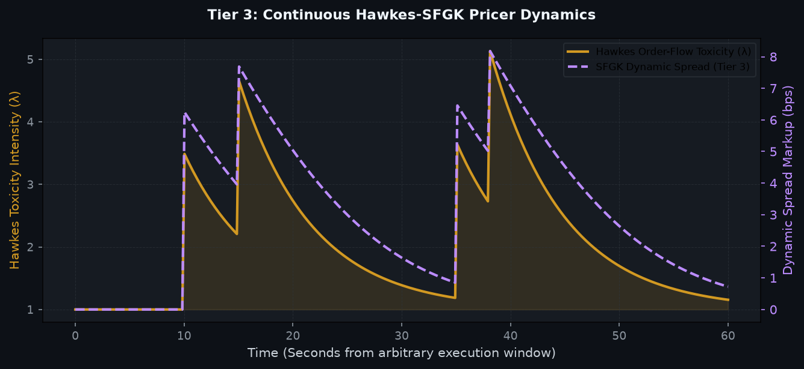

# 📈 Visual Intelligence Gallery
> **Generated:** `2026-08-18 16:49:25`
> **[Return to Main Status Report](./hourly_status_report.html)**

This page visualizes the internal states, market profiles, and decision criteria of the active **3-Tier Fused Decision Engine** across all layers.

---
## Tier 1: Macro Volatility Tensor Gate (Omega_macro)
Evaluating global asset compression/expansion against the mathematically optimal Yield System Parameters (YSP).

---
## Tier 2: Unified Transport & Directional Engine
Zero-shot foundation model trajectories. AI forecasts must satisfy minimum scalar threshold velocity requirements.

---
## Tier 3: Continuous Hawkes-SFGK Pricer
Dynamic market microstructure toxicity evaluation. Instead of hard binary halting during toxic environments, Tier 3 actively dilates spreads proportional to Hawkes Intensity.

---
## 3-Tier Fused Decision Funnel Rejection Metrics
Live telemetry cascading down the 3-Tier waterfall. Visualizes exactly where trade volume drops due to safety evaluations.

---
## Global System PnL Trajectory

---
## VSTEF Grid Sweep Profiling
Continuous optimization grid evaluation profiling historical asset win-rates against baseline.

